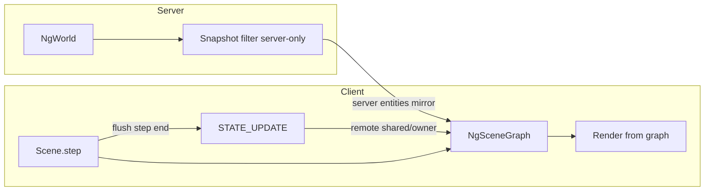

# cube-p parity — all phases

**Revalidated:** 2026-07-26 — `scripts/validate.sh` **ALL OK** (build + agent + ENet/WS cube cmd + latency + embed + web artifact).

**Gap:** validate does **not** load `cube.js` in Duktape or assert SESSION after `scene cube`. net_smoke prints stale connect `SESSION scene=sphere` before `REPLY: scene loaded: cube`. Client cube visibility requires manual `./ngame --local`.

---

## Architecture target

Three **authority lanes** — snapshots never overwrite local JS graph data:

| Sync | Sim | Wire out | Wire in (client) | Server snapshot |
|------|-----|----------|------------------|-----------------|
| `server` | `NgWorld` | Snapshot @ 20Hz | Apply snap only | **Yes** |
| `shared` | JS all clients | Step-end delta | Remote peer deltas | **No** |
| `owner` | JS controller | Step-end delta | Controller + relay | **No** |
| `local` | JS one client | None | None | **No** |

**Gaffer hybrid (not pure lockstep):**

- **Server entities:** snapshot interpolation ([Gaffer snapshot](https://gafferongames.com/post/snapshot_interpolation/)) — bandwidth for state, interpolate on client.
- **JS entities:** step-end **component deltas** only ([Gaffer lockstep spirit](https://gafferongames.com/post/deterministic_lockstep/)) — bandwidth ∝ changed fields, not entity count; no periodic full state.
- **No** full deterministic lockstep (Duktape + float JS ≠ deterministic).



---

## Current baseline (post-cleanup)

| Component | Status |
|-----------|--------|
| `mod_scene.c` | Duktape host, `global.*` bindings, Scene lifecycle |
| `mod_scene_graph.c` | describe/spawn/inst store, rot-only dirty queue |
| `mod_net.c` | SESSION, STATE_UPDATE relay, flush after step |
| `mod_render.c` | Graph draw when `client_fields_active`; fixed cube camera |
| `cube.js` | ES5, Duktape-safe |
| `NgStateUpdate` | rot_y only, v2 proto |
| Snapshot | Skips cube type for js-host scenes (hack); still flat `NgEntitySnap` |

**Known bugs to fix in Phase 0:**

1. Render dead zone: `scene_label=cube` + `!loaded` → no graph, no snapshot cube.
2. Bootstrap only on `NG_PKT_SESSION`, not `ACTION_RESULT`.
3. Entity lifecycle: only Scene + entity `step`; no entity init/start on spawn.
4. `describe(mesh/shader/model)` metadata unused; render uses hardcoded assets.

---

## Phase 0 — Unblock visible cube + validate gap

**Goal:** Cube always visible after `scene cube`; CI catches JS load failure.

### Tasks

- [ ] **P0.1** Render gate: draw graph when `mod_scene_graph_inst_count() > 0` OR `mod_scene_js_loaded()`; never dead-zone.
- [ ] **P0.2** Bootstrap: on `ACTION_RESULT` with scene change, synthesize minimal session or queue until `SESSION` — call `mod_scene_on_session` with correct `cube_entity_id`.
- [ ] **P0.3** Ensure post-`scene cube` SESSION has `scene=cube sync=shared cube_entity_id!=0` (fix ordering if connect SESSION overwrites).
- [ ] **P0.4** Add `tools/scene_js_smoke.c` (or extend net_smoke): load Duktape, eval `cube.js`, assert `Scene` + spawn → `inst_count==1`.
- [ ] **P0.5** Add validate step: run scene_js_smoke after ENet cube cmd.

### Files

`mod_render.c`, `mod_net.c`, `mod_scene.c`, `tools/scene_js_smoke.c`, `scripts/validate.sh`, `CMakeLists.txt`

### Done when

- `./ngame --local` → `scene cube` → cube visible, A/D rotates, camera fixed.
- `validate.sh` includes JS load smoke.

---

## Phase 1 — cube-p scene runtime API

**Goal:** JS `describe/spawn/dispose` + entity lifecycle match `cube-p.js`.

### Tasks

- [ ] **P1.1** Asset registry (`mod_scene_assets.c/h`): mesh/shader/model describe stores paths + params; return stable ids.
- [ ] **P1.2** Render resolves model id → mesh + shader (replace hardcoded cube/sphere pick by string).
- [ ] **P1.3** Entity lifecycle on spawn: `init()` → `start()`; despawn: `stop()` → `dispose()`.
- [ ] **P1.4** Entity `step` gating per sync:
  - `server`: skip on client
  - `shared`: all clients
  - `owner`: controller only (others apply remote)
  - `local`: only owning peer
- [ ] **P1.5** Bindings: `get/set_rotation_x` (optional KEY_W in cube.js).
- [ ] **P1.6** `set_scale` applied in draw (`DrawModelEx` scale vector).
- [ ] **P1.7** Align `cube.js` with `cube-p.js` names/comments.

### Files

`mod_scene.c`, `mod_scene_graph.c/h`, `mod_scene_assets.c/h`, `mod_render.c`, `res/scenes/cube.js`, `CMakeLists.txt`

### Done when

- cube-p lifecycle comments satisfied in code paths (not just stubs).
- Multiple entities + mixed sync in a test scene JS.

---

## Phase 2 — Wire v3: full step-end deltas

**Goal:** cube-p rule: *all changes delta, flushed at step end*.

### Tasks

- [ ] **P2.1** Extend `NgStateUpdate` / proto v3:
  ```
  entity_id, tick, seq, comp_mask,
    pos[3]?  rot[3]?  scale?  flags?
  ```
- [ ] **P2.2** Bump `NG_PROTO_VERSION` → 3; update `net_smoke`, `cmd_latency`, `validate`.
- [ ] **P2.3** `set_position` / `set_rotation` / `set_scale` mark correct `NG_COMP_*` when `ng_sync_posts_wire`.
- [ ] **P2.4** `take_dirty` emits all dirty comps; batch N entities per packet per step.
- [ ] **P2.5** `apply_remote`: seq/tick ordering; no self-echo; remove zero-snap heuristic.
- [ ] **P2.6** Quantize pos (cm) / rot (millideg) on wire.

### Files

`ng_session.h`, `ng_proto.c/h`, `mod_scene_graph.c`, `mod_net.c`, `tools/*.c`

### Done when

- Position + full rotation sync on shared cube between two clients.
- validate + proto smoke green on v3.

---

## Phase 3 — Snapshot isolation (no local conflict)

**Goal:** Server snapshots never touch JS graph instances.

### Tasks

- [ ] **P3.1** Server entity registry: each spawned id tagged with `NgSyncMode` (from SESSION spawn table, Phase 4).
- [ ] **P3.2** `ng_world_fill_snapshot*`: include **only** `NG_SYNC_SERVER` entities (remove `ng_scene_has_js_host` + type hack).
- [ ] **P3.3** Client: snapshot apply → **server mirror layer** only (small map or flags on graph inst `authority=server`).
- [ ] **P3.4** Render merge: graph is single source for js-host scenes; snapshot feeds server-only entities (sphere) in hybrid scenes later.
- [ ] **P3.5** Remove `mod_scene_client_fields_active` dual-path confusion → `mod_scene_uses_graph()` + `mod_scene_graph_has_inst()`.

### Files

`ng_world.c/h`, `mod_sim.c`, `mod_render.c`, `mod_scene_graph.c/h`, `mod_scene.c`

### Done when

- Rotating shared cube never snaps from 20Hz snapshot.
- Sphere scene unchanged (snapshot interpolation).

---

## Phase 4 — SESSION v2 + spawn table

**Goal:** Stable ids and sync modes at bootstrap; no race with ACTION_RESULT.

### Tasks

- [ ] **P4.1** Extend `NG_PKT_SESSION`:
  ```
  scene_id, tick, your_id, controller_id,
  spawn_count,
    [{ entity_id, desc_name[32], sync }]*
  ```
- [ ] **P4.2** Server fills spawn table from sim + scene registry on scene load.
- [ ] **P4.3** Client `start(session)`: spawn from table if JS hasn't yet (or JS spawn uses session ids only).
- [ ] **P4.4** Deprecate lone `cube_entity_id` + scene-level `scene_sync` (keep compat read for v2 clients one release).

### Files

`ng_session.h`, `ng_proto.c`, `mod_net.c`, `mod_session.c`, `mod_scene.c`, `sim_cube.c`

### Done when

- net_smoke prints `SESSION scene=cube sync=shared cube=N` after scene cube.
- No stale sphere SESSION after scene switch.

---

## Phase 5 — Bandwidth polish (Gaffer-inspired)

**Goal:** Minimize bytes/step for JS entities; keep server snapshot efficient.

### Tasks

- [ ] **P5.1** Batch all step dirty insts into one unreliable packet (or few MTU-sized).
- [ ] **P5.2** Reliable channel for SESSION + spawn/despawn lifecycle events only.
- [ ] **P5.3** Per-entity `last_applied_seq` ack in INPUT or side channel (detect loss without lockstep stall).
- [ ] **P5.4** Optional redundant delta resend (last K seqs) for shared entities — lockstep-style redundancy without determinism.
- [ ] **P5.5** Enable AOI snapshot for server entities (`ng_world_fill_snapshot_aoi`) when entity count > threshold.
- [ ] **P5.6** Tool: `ng_cmd_bandwidth` — bytes/sec snapshot vs delta over 10s.

### Done when

- Shared cube rotation < 200 B/step typical @ 60Hz client step.
- Server snapshot bandwidth unchanged for sphere-only scenes.

---

## Phase 6 — Embedded + multi-client CI

**Goal:** Web/native embedded path; two-client shared sync smoke.

### Tasks

- [ ] **P6.1** Register `mod_scene` in `ng_app_embedded.c` OR document js-host = native client only.
- [ ] **P6.2** If embedded: loopback SESSION + graph draw (replace pred_yaw embed cube path).
- [ ] **P6.3** `tools/two_client_smoke.sh`: two ENet clients, A rotates cube, B receives STATE_UPDATE.
- [ ] **P6.4** Owner-mode test scene + smoke.
- [ ] **P6.5** Local-mode entity invisible on other clients.

### Files

`ng_app_embedded.c`, `tools/two_client_smoke.c/sh`, `scripts/validate.sh`, `res/scenes/`

### Done when

- validate includes two-client smoke (optional nightly if flaky).
- Embedded either supports cube scene or explicitly excluded in docs.

---

## Dependency graph

```
Phase 0 (visible cube)
  ↓
Phase 3 partial (snapshot isolation) ──→ Phase 4 (SESSION v2)
  ↓                                        ↓
Phase 1 (runtime API) ──────────────────→ Phase 2 (wire v3)
  ↓                                        ↓
Phase 5 (bandwidth) ←──────────────────────┘
  ↓
Phase 6 (embedded + multi-client)
```

**Recommended execution order:** 0 → 3 (partial) → 1 → 4 → 2 → 5 → 6

---

## Revalidation checklist (run after each phase)

```bash
cd build && cmake --build .
bash scripts/validate.sh
# Phase 0+: ./build/tools/scene_js_smoke
# Phase 6+: ./build/tools/two_client_smoke
# Manual: ./ngame --local → scene cube → A/D
```

| Phase | validate.sh | JS smoke | Manual cube | Two-client |
|-------|-------------|----------|-------------|------------|
| 0 | ✓ | ✓ | ✓ | — |
| 1 | ✓ | ✓ | ✓ | — |
| 2 | ✓ | ✓ | ✓ | optional |
| 3 | ✓ | ✓ | ✓ | — |
| 4 | ✓ | ✓ | ✓ | — |
| 5 | ✓ | ✓ | ✓ | — |
| 6 | ✓ | ✓ | ✓ | ✓ |

---

## Proto version roadmap

| Version | Changes |
|---------|---------|
| 2 (current) | SESSION, STATE_UPDATE rot_y only |
| 3 | STATE_UPDATE pos+rot+scale, batched |
| 4 | SESSION spawn table, deprecate cube_entity_id |

---

## Out of scope (later)

- Deterministic fixed-point sim / true lockstep
- Full mesh/shader hot-reload from JS params without C asset loader
- Component ECS beyond scene graph inst list
- WebSocket STATE_UPDATE (ENet first)
