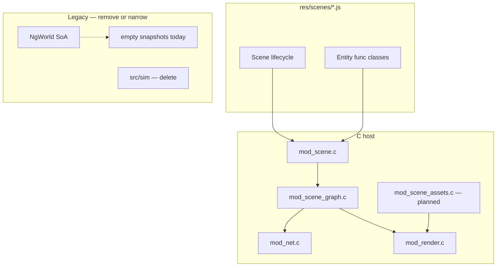

# Scene layer rigify — master plan

**Validated:** 2026-07-28 — `scripts/validate.sh` **ALL OK**

```
agent + ENet/WS scene cube + scene_js_smoke + latency + embed + web artifact
SNAPSHOT entities=0 (NgWorld empty — expected until Phase 3)
SESSION spawns=1 after scene cube ✓
```

**High-level surface:** `res/scenes/*.js` (ES5, Duktape). Authoritative scenes: `cube.js`, `sphere.js`.

**Supersedes:** `cube-p-parity-all-phases.plan.md` (stale baseline, cube-p spec deleted).

---

## Architecture target

| Sync | Authority | Sim runs on | Wire out | Client receives |
|------|-----------|-------------|----------|-----------------|
| `server` | C / NgWorld mirror | server host | Snapshot @ 20Hz | Snap → mirror layer |
| `shared` | JS graph | all clients | Step-end STATE_UPDATE | Remote deltas |
| `owner` | JS graph | controller | Step-end STATE_UPDATE | Controller + relay |
| `local` | JS graph | one peer | none | none |



---

## Validated baseline (2026-07-28)

| Component | Status |
|-----------|--------|
| `mod_scene.c` | Duktape host, `global.*`, Scene + entity lifecycle |
| `mod_scene_graph.c` | describe/spawn/registry, dirty pos/rot/scale |
| `mod_net.c` | SESSION + spawn table, STATE_UPDATE flush after step |
| `mod_render.c` | Graph draw when loaded/active; scene-name camera/bg hack |
| `res/scenes/cube.js` | ES5, shared sync, A/D on Scene.step |
| `res/scenes/sphere.js` | ES5, server sync, entity phase in JS only |
| `NgStateUpdate` + proto | v3, pos/rot/scale comp_mask |
| `tools/scene_js_smoke.c` | cube registry + sphere inst smoke |
| `src/sim/*` | **Orphaned** — not in CMake, zero callers |

### Observed validate output (facts)

- Connect: `SESSION scene=sphere spawns=1`, `SNAPSHOT entities=0`
- After `scene cube`: `REPLY: scene loaded: cube`, `SESSION scene=cube spawns=1`
- `scene_sync` wire field always prints `server` (hardcoded in `mod_net_fill_session`)
- Sphere `this.phase` in JS does **not** reach render or snapshots (migration gap)

---

## Slice 0 — Cleanup (establish surface)

**Goal:** One truth for scenes; delete dead C/JS.

### Tasks

- [ ] **S0.1** Delete `res/scenes/cube-p.js` (spec absorbed into this plan + `cube.js`)
- [ ] **S0.2** Delete `src/sim/` (`sim_cube.c`, `sim_sphere.c`, `sim_types.h`) — not compiled
- [ ] **S0.3** Remove dead input path: `NG_MSG_INPUT` publish with no subscriber, or wire to scene (decide: delete)
- [ ] **S0.4** Remove `ng_world_apply_input` if input path deleted
- [ ] **S0.5** Document scene authoring contract in plan (init/start/step/stop/dispose + describe kinds)
- [ ] **S0.6** Archive redirect stub in old `cube-p-parity-all-phases.plan.md`

### Files

`res/scenes/`, `src/sim/`, `src/world/ng_world.c`, `src/mod/mod_net.c`, `.cursor/plans/`

### Done when

- Only `cube.js` + `sphere.js` under `res/scenes/`
- No `src/sim/` references
- `validate.sh` green

---

## Slice 1 — Asset registry (Phase 1 core)

**Goal:** JS `describe(mesh/shader/model)` drives render; no substring/scene-name hacks.

### Tasks

- [ ] **S1.1** Add `mod_scene_assets.c/h`: store mesh params, shader paths, model → mesh+shader refs
- [ ] **S1.2** `bind_describe` for mesh/shader/model writes asset registry (return stable id)
- [ ] **S1.3** `mod_render_draw_graph_inst`: resolve `inst->model` via registry → `RenderAsset`
- [ ] **S1.4** Preload fallback assets at init only for boot; scenes use describes
- [ ] **S1.5** Draw full `rot[0..2]` (Euler Y primary for cube; support rot_x binding)
- [ ] **S1.6** Optional: bind `KEY_W` + document input keys in scene template

### Files

`src/mod/mod_scene_assets.c`, `mod_scene_assets.h`, `mod_scene.c`, `mod_scene_graph.c`, `mod_render.c`, `CMakeLists.txt`

### Done when

- `cube.js` mesh/shader/model describes affect draw without hardcoded `"cube"` string match
- Manual: `./ngame --local` → `scene cube` → A/D rotates visible cube

---

## Slice 2 — Server authority bridge (Phase 3 + sphere fix)

**Goal:** `sync: server` entities use NgWorld/snapshot path; JS graph untouched for shared.

### Tasks

- [ ] **S2.1** On server spawn of `NG_SYNC_SERVER` entity: mirror graph inst → `NgWorld` (pos/rot/phase)
- [ ] **S2.2** Server entity `step` in JS updates graph; flush mirror fields to NgWorld each tick
- [ ] **S2.3** Add `phase` (or flags) to graph inst + snapshot comp for server entities
- [ ] **S2.4** `ng_world_fill_snapshot*`: include **only** server-sync entity ids
- [ ] **S2.5** Client snapshot apply → server mirror map (not shared graph insts)
- [ ] **S2.6** Render merge: graph insts (shared/owner/local) + snapshot mirror (server)
- [ ] **S2.7** Shared cube rotation never overwritten by 20Hz snapshot

### Files

`mod_scene.c`, `mod_scene_graph.c/h`, `ng_world.c/h`, `mod_render.c`, `mod_net.c`, `res/scenes/sphere.js`

### Done when

- Sphere phase animates on client via snapshot interpolation
- Cube shared rotation stable under snapshot traffic
- Snapshots have `entities>=1` for sphere scene on server

---

## Slice 3 — SESSION hygiene (Phase 4 remainder)

**Goal:** Spawn table is sole bootstrap; no misleading legacy fields.

### Tasks

- [ ] **S3.1** Stop hardcoding `session->scene_sync = NG_SYNC_SERVER`; derive from primary spawn or omit on wire
- [ ] **S3.2** Client `mod_scene_on_session`: apply spawns before `start()` (ordering audit)
- [ ] **S3.3** net_smoke: assert spawn entry sync matches entity describe (`shared` for cube)
- [ ] **S3.4** Proto v4 (optional): drop `scene_sync` field; spawn table only

### Files

`mod_net.c`, `ng_proto.c`, `ng_session.h`, `tools/net_smoke.c`

### Done when

- net_smoke prints spawn sync=`shared` for cube entity
- No stale sphere session after scene switch (already passes; keep regression)

---

## Slice 4 — Wire polish (Phase 2 remainder)

**Goal:** Step-end deltas complete and efficient.

### Tasks

- [ ] **S4.1** Batch N dirty entities per STATE_UPDATE packet (MTU-sized)
- [ ] **S4.2** `apply_remote`: seq ordering, ignore self-echo, stale tick drop
- [ ] **S4.3** Quantize pos (cm) / rot (millideg) on wire
- [ ] **S4.4** Extend smoke: two clients optional in validate (Slice 5)

### Files

`mod_scene_graph.c`, `mod_net.c`, `ng_proto.c`, `tools/two_client_smoke.c`

### Done when

- Position + full rotation sync between two clients on shared cube
- validate green

---

## Slice 5 — CI + embedded (Phase 6)

**Goal:** Multi-client and embedded paths covered.

### Tasks

- [ ] **S5.1** `tools/two_client_smoke.sh`: client A rotates, client B receives STATE_UPDATE
- [ ] **S5.2** Owner-mode mini scene + smoke
- [ ] **S5.3** Local-mode: invisible on other clients
- [ ] **S5.4** Embedded: graph draw path verified for `scene cube` (already partial)
- [ ] **S5.5** Add two_client to validate (nightly flag if flaky)

### Files

`tools/`, `scripts/validate.sh`, `ng_app_embedded.c`

---

## Slice 6 — Bandwidth (Phase 5, later)

- [ ] **S6.1** Single batched unreliable packet per step
- [ ] **S6.2** Reliable channel for SESSION + lifecycle only
- [ ] **S6.3** Per-entity seq ack
- [ ] **S6.4** `ng_cmd_bandwidth` tool
- [ ] **S6.5** AOI snapshot when server entity count > threshold

---

## Phase completion matrix

| Original | Task | Status |
|----------|------|--------|
| P0.1 | Render gate graph/loaded | **done** |
| P0.2 | ACTION_RESULT bootstrap | **done** (have_state=false; SESSION drives client) |
| P0.3 | SESSION after scene cube | **done** (spawns=1) |
| P0.4 | scene_js_smoke | **done** |
| P0.5 | validate includes smoke | **done** |
| P1.1 | Asset registry | **open** → S1 |
| P1.2 | Render from model id | **open** → S1 |
| P1.3 | Entity init/start on spawn | **done** |
| P1.4 | Step gating by sync | **done** |
| P1.5 | rot_x + KEY_W | **partial** (bindings yes, KEY_W no) |
| P1.6 | scale in draw | **done** |
| P1.7 | cube-p parity | **cancelled** (cube-p deleted) |
| P2.1–P2.3 | NgStateUpdate v3 | **done** |
| P2.4–P2.6 | batch/ordering/quantize | **open** → S4 |
| P3.1–P3.4 | Snapshot isolation | **open** → S2 |
| P3.5 | client_fields_active | **done** (removed) |
| P4.1–P4.3 | SESSION spawn table | **done** |
| P4.4 | Deprecate scene_sync | **open** → S3 |
| P5.* | Bandwidth | **open** → S6 |
| P6.* | Embedded + two-client | **open** → S5 |

---

## C leftovers map (delete or narrow)

| Item | Action | Slice |
|------|--------|-------|
| `src/sim/*` | Delete | S0 |
| `res/scenes/cube-p.js` | Delete | S0 |
| `ng_world_apply_input` + `NG_MSG_INPUT` | Delete or wire | S0 |
| Empty NgWorld snapshots as primary state | Narrow to server-sync only | S2 |
| `session->scene_sync` hardcode | Fix or remove | S3 |
| `mod_render` scene name camera/bg | Move to scene metadata or assets | S1 |
| `strstr(model,"sphere")` asset pick | Replace with asset registry | S1 |
| `bind_describe` default model `"cube"` | Require explicit model in JS | S1 |
| Snapshot interpolation path for JS entities | Keep only for server mirror | S2 |
| `ng_world_hash` on empty world | Optional: hash graph registry instead | S2 |

---

## Scene authoring contract (establish)

```javascript
// ES5 — required by Duktape
function Entity() {}
Entity.prototype.init = function () {};
Entity.prototype.start = function () {};
Entity.prototype.step = function (dt) {};
Entity.prototype.stop = function () {};
Entity.prototype.dispose = function () {};

function Scene() {}
Scene.prototype.init = function () {
  // global.describe("mesh"|"shader"|"model"|"entity", name, opts)
};
Scene.prototype.start = function (session) {
  // this.handle = global.spawn("entity_name");
};
Scene.prototype.step = function (dt) {};
Scene.prototype.stop = function () {};
Scene.prototype.dispose = function () {};
```

**Describe kinds:** `mesh`, `shader`, `model`, `entity`

**Entity opts:** `model`, `func`, `sync` (`server`|`shared`|`owner`|`local`)

**Global API:** `describe`, `spawn`, `despawn`, `dispose`, `get_input`, transform get/set, `KEY_A`, `KEY_D`

---

## Execution order

```
S0 cleanup
  ↓
S1 asset registry + render
  ↓
S2 server bridge + snapshot isolation
  ↓
S3 SESSION hygiene
  ↓
S4 wire batch/quantize
  ↓
S5 two-client CI
  ↓
S6 bandwidth (optional)
```

---

## Revalidation (after each slice)

```bash
cd build && cmake --build .
bash scripts/validate.sh
./build/tools/scene_js_smoke
# S5+: ./build/tools/two_client_smoke
# Manual: ./build/ngame --local → scene cube → A/D
# Manual: ./build/ngame --local → scene sphere → phase anim
```

| Slice | validate | js_smoke | manual cube | manual sphere | two-client |
|-------|----------|----------|-------------|---------------|------------|
| S0 | ✓ | ✓ | ✓ | — | — |
| S1 | ✓ | ✓ | ✓ | — | — |
| S2 | ✓ | ✓ | ✓ | ✓ | — |
| S3 | ✓ | ✓ | ✓ | — | — |
| S4 | ✓ | ✓ | ✓ | — | opt |
| S5 | ✓ | ✓ | ✓ | ✓ | ✓ |

---

## Proto roadmap

| Version | Status | Notes |
|---------|--------|-------|
| 2 | superseded | rot_y only |
| 3 | **current** | STATE_UPDATE pos+rot+scale |
| 4 | planned | drop scene_sync; spawn table canonical |

---

## Out of scope

- Deterministic lockstep / fixed-point sim
- ECS beyond scene graph list
- Hot-reload shaders from JS without C loader
- WebSocket STATE_UPDATE before ENet path stable
