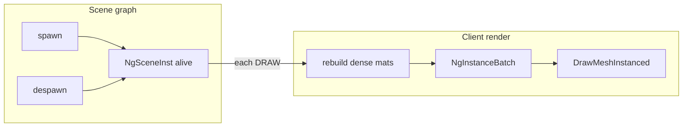

<!-- agent: composer-2.5 | 2026-08-09 | instanced draw architecture | 4c1c7a -->
# Instanced draw

Client render batches entities that share a **model** into one GPU draw call via Raylib `DrawMeshInstanced`.

## Why

Previously each live `NgSceneInst` called `DrawModel` (N draws). Mesh, material, and shader uniforms are identical per model; only the world transform differs. Instancing uploads a dense transform prefix and draws once per model.

## Data model

Per-model CPU pool in `src/client/render.c`:

| Field | Role |
|-------|------|
| `model` | Batch key (`inst->model`, not describe name) |
| `mats` | Dense `Matrix` array, packed `[0..count)` |
| `count` | Live instances this frame |
| `capacity` | Allocated slots; starts at **1**, **doubles** when full |

Asset mesh/shader/tint stay in the existing `RenderAsset` cache (keyed by the same model name).

## Growth and free

```
need > capacity  →  capacity = max(1, capacity * 2) via realloc
OOM              →  keep old buffer; skip append for that instance
scene / session  →  free all mats; capacity forgotten until next use
mid-scene        →  never shrink (avoids thrash under spawn churn)
```

## Lifecycle



- **Graph** owns spawn/despawn identity (`id`, handle, key).
- **Render** does **not** keep entity↔slot maps. Each DRAW resets `count` to 0 and re-appends matrices for every live inst (poses are sampled every frame anyway).
- Despawn is implicit: absent next rebuild → not written; pool capacity retained.

If membership must later avoid a full graph walk, use dense swap-remove plus `entity_id → slot` (generation-safe handles). Not required while pose rebuild already walks the graph.

## Draw path

1. Reset all batch `count` to 0.
2. Walk live graph (or snapshot entities); resolve model → batch; append world matrix.
3. For each batch with `count > 0`: set material uniforms once; `DrawMeshInstanced(mesh, material, mats, count)`.

Shared shader time is `GetTime()` only. Per-instance `phase` is unused on the instanced path.

## Shader contract

[`res/shaders/mesh.vs`](../res/shaders/mesh.vs) must declare Raylib’s instance attribute:

```glsl
in mat4 instanceTransform;
// fragPosition / gl_Position use instanceTransform
// gl_Position = mvp * instanceTransform * vec4(vertexPosition, 1.0);
```

`uniform matModel` alone cannot instance: `DrawMeshInstanced` binds `instanceTransform`, not the model uniform.

## Limits

- Material uniforms (tint, glow, roughness, metalness) are **per model**, not per instance.
- No persistent GPU VBO: Raylib uploads the transform prefix each call.
- Graph hole compaction / `NG_SCENE_INST_MAX` unchanged.

<!-- agent: composer-2.5 | 2026-08-09 | instanced draw architecture | 4c1c7a -->
